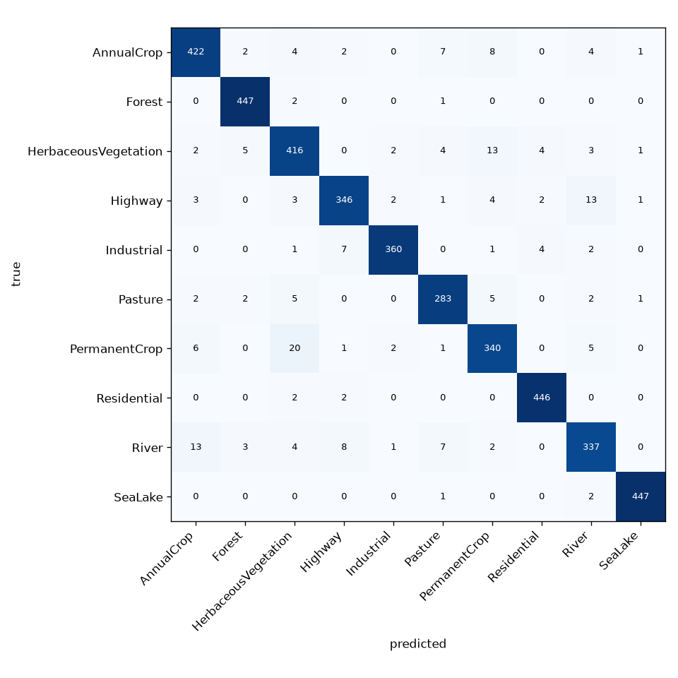

# keras-image-classifier

A small, reproducible image-classification pipeline built on Keras 3: prepare a folder of
images, split it without leakage, train a compact CNN, evaluate it and classify new files, all
from one command-line tool. Version 1.0.1, stable; it started as university coursework in 2024
and was rewritten in 2026 (see [History](#history)).

[](https://github.com/tudorandrian/keras-image-classifier/actions/workflows/ci.yml)


## What it shows

- Data handling that can be audited: every image is decoded defensively, identified by the
  SHA-256 of its pixels, deduplicated, and split by a seeded, stratified rule that does not
  depend on file names or on the file system.
- A training run that records what is needed to repeat it: configuration, seed, class list,
  library versions, per-epoch history, best epoch.
- Evaluation against a baseline, per class, with a confusion matrix and a Markdown report.
- Tests that assert numbers, including one that trains a real model and must reach 0.9 accuracy.
- No Anaconda and no TensorFlow: `uv` and a lock file, Keras 3 on the JAX backend, an
  environment of 609 MB including the development tools.

## Quick start (no data download, under a minute after `uv sync`)

Install [uv](https://docs.astral.sh/uv/getting-started/installation/), then:

```bash
git clone https://github.com/tudorandrian/keras-image-classifier.git
cd keras-image-classifier
uv sync                                   # Python 3.13 and every dependency, from uv.lock
uv run kic synth data/raw                 # 600 drawn shapes in 3 classes, no download
uv run kic prepare data/raw data/shapes --image-size 48
uv run kic split data/shapes
uv run kic train data/shapes runs/shapes  # 15 epochs by default: 105 optimiser steps
uv run kic evaluate runs/shapes           # writes runs/shapes/report.md
uv run kic predict runs/shapes data/raw/circle/circle_00001.png
```

The six `kic` commands took 52 seconds together on the laptop described in
[docs/testing.md](docs/testing.md) and ended at test accuracy 1.000 against a majority baseline
of 0.333.

Without uv: `python -m venv .venv`, activate it, `pip install .`, and use `kic` in place of
`uv run kic`. That route takes the newest versions the ranges in `pyproject.toml` allow
instead of the locked ones.

## Give a run at least about 50 optimiser steps

Epochs times steps-per-epoch is the number that matters, not epochs. The network uses batch
normalisation, whose moving averages start far from the truth, so until roughly 50 optimiser
steps have passed the model answers **at chance in inference mode, even on its own training
images**. A short run therefore shows training accuracy near 1.0 next to a validation accuracy
sitting exactly on the majority baseline. That looks like shuffled labels or a broken pipeline.
It is neither, and it clears itself as the run gets longer:

| Steps so far | Training accuracy | Validation accuracy |
| ---: | ---: | ---: |
| 28 | 1.0000 | 0.3333 |
| 35 | 1.0000 | 0.3444 |
| 42 | 1.0000 | 0.9333 |
| 49 | 1.0000 | 1.0000 |

(Synthetic shapes, 420 training images, batch size 64, so 7 steps per epoch. The full run is in
[docs/testing.md](docs/testing.md); the mechanism is in
[docs/architecture.md](docs/architecture.md).)

So: before believing any validation number, check that epochs times steps-per-epoch is well past
50. The quick start above runs 105 steps and the EuroSAT benchmark 5,920, both comfortably
clear. If accuracy sits near the majority baseline on a short run, lengthen the run. Do not
lower a threshold to make it pass.

## The benchmark: EuroSAT

[EuroSAT](https://doi.org/10.5281/zenodo.7711810) is 27,000 Sentinel-2 satellite patches of
64 x 64 px in ten land-use classes, MIT-licensed, with no people in it.

```bash
uv run kic fetch-eurosat data/eurosat-raw     # 95 MB from Zenodo, SHA-256 verified
uv run kic prepare data/eurosat-raw data/eurosat --image-size 64
uv run kic split data/eurosat
uv run kic train data/eurosat runs/eurosat --epochs 20
uv run kic evaluate runs/eurosat
```

| Measure | Value |
| --- | --- |
| Test accuracy, 4,050 held-out images | **0.9491** |
| Macro F1 | 0.9473 |
| Majority-class baseline | 0.1111 |
| Weakest class | River, F1 0.907 |
| Training | 20 epochs, 1,357 s (23 minutes) on a 4-core laptop CPU from 2017, no GPU |



The numbers come from one run with seed 0 on a laptop CPU; the full report, with per-class
figures, is in [docs/results/eurosat/report.md](docs/results/eurosat/report.md), and the exact
configuration and library versions that produced it are in
[docs/results/eurosat/run.json](docs/results/eurosat/run.json). The network has 99,450
parameters. Helber et al. report higher accuracy with an ImageNet-pretrained ResNet-50; this
project is about the pipeline around the model, and keeps the model small enough to train
without a GPU. The split here is this project's own seeded 70/15/15 split, so compare published
numbers with care.

## Your own data

Any directory with one sub-directory per class works:

```
my-data/
  cats/  anything.jpg ...
  dogs/  anything.png ...
```

JPEG, PNG, WEBP and BMP are accepted. Unreadable files are skipped and listed with the reason in
`manifest.json`. Do not commit data or runs: `data/`, `runs/` and `*.keras` are ignored by git.
If your images show people, you are responsible for having the right to process them.

## Commands

| Command | Does |
| --- | --- |
| `kic synth DEST` | writes a synthetic shapes data set |
| `kic fetch-eurosat DEST` | downloads and verifies EuroSAT RGB |
| `kic prepare SRC DEST --image-size N` | decodes, letterboxes to N x N, deduplicates, writes `manifest.json` |
| `kic split PREPARED --ratios 0.7 0.15 0.15 --seed 0` | writes `splits.json` |
| `kic train PREPARED RUN_DIR` | trains; `--epochs --batch-size --learning-rate --width --dropout --patience --seed --no-augment` |
| `kic evaluate RUN_DIR --split test` | writes `metrics.json`, `confusion_matrix.png`, `report.md` |
| `kic predict RUN_DIR FILE...` | prints the top labels for each file as JSON |
| `kic info` | prints versions and the active Keras backend |

Every command prints JSON and exits with 0, or prints one line to standard error and exits
with 2 when the problem is one you can fix. A truncated or hand-edited `manifest.json`,
`splits.json` or `run.json` is one of those problems, not a crash.

`kic train` creates its run directory before it starts fitting, and refuses to write into a
directory that already has something in it, so a run you interrupt with Ctrl-C leaves that
directory populated and the next attempt at the same path fails with "is not empty; every run
gets its own directory". Delete the directory, or train into a new one.

## Documentation

- [docs/architecture.md](docs/architecture.md): data flow, modules, and the reason behind each decision
- [docs/testing.md](docs/testing.md): test levels, what is asserted, measurements, known limits
- [SECURITY.md](SECURITY.md): threat model and how to report a problem
- [CHANGELOG.md](CHANGELOG.md)

## Development

```bash
uv run ruff check . && uv run ruff format --check . && uv run mypy
uv run bandit -q -r src && uv run python scripts/check_text.py
uv run pytest --cov            # includes a real training run
```

## History

The first version was coursework for a computer-vision class at the West University of
Timisoara in November 2024: five interactive scripts around TensorFlow. It is preserved under
the tag [`v0.1.0-coursework`](https://github.com/tudorandrian/keras-image-classifier/tree/v0.1.0-coursework).
Version 1.0.0 keeps the idea (collect, preprocess, deduplicate, split, train, classify) and
replaces the implementation; [CHANGELOG.md](CHANGELOG.md) lists what was wrong and what changed.
No photograph and no data-set image has ever been committed to this repository, in any branch
or tag; the only image it contains is the confusion matrix above.

## Related repositories

Each runs on its own and has its own instructions:

- [vision-lab-flask](https://github.com/tudorandrian/vision-lab-flask): classical image
  processing and pretrained detection and segmentation models behind a small Flask interface.

## Licence and citation

Code: [MIT](LICENSE). EuroSAT: MIT, Helber et al., "EuroSAT: A Novel Dataset and Deep Learning
Benchmark for Land Use and Land Cover Classification", IEEE JSTARS, 2019,
doi:10.1109/JSTARS.2019.2918242. To cite this repository, see [CITATION.cff](CITATION.cff).
